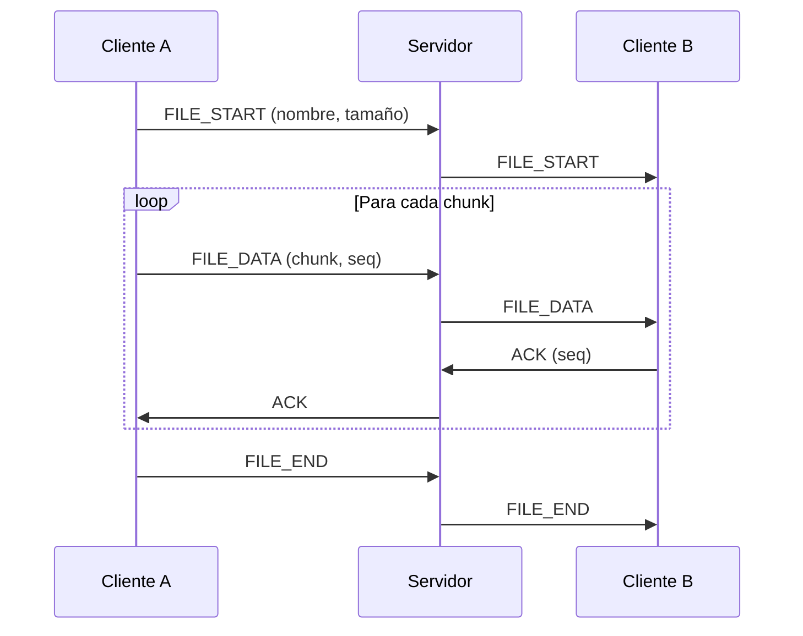

# 🚀 Servidor de Chat y Transferencia de Archivos

Un servidor TCP en C# que permite chat en tiempo real y transferencia de archivos entre múltiples clientes conectados.

## 🎯 Características

- **Chat en tiempo real** - Mensajes públicos y privados
- **Transferencia de archivos** - Envío de archivos entre clientes
- **Protocolo propio** - Comunicación binaria eficiente
- **Multihilo** - Soporte para múltiples clientes simultáneos
- **Thread-safe** - Manejo seguro de concurrencia
- **Manejo de errores** - Reconexiones y recuperación automática
- **Confirmaciones ACK** - Garantía de entrega de archivos

## 🏗️ Arquitectura

### Protocolo de Comunicación

El sistema utiliza un protocolo binario propio con los siguientes tipos de mensajes:

- `CHAT` (0x01) - Mensajes de texto/chat
- `FILE_START` (0x02) - Inicio de transferencia (nombre, tamaño)
- `FILE_DATA` (0x03) - Bloques de datos binarios
- `FILE_END` (0x04) - Fin de transferencia
- `ACK` (0x05) - Confirmación de recepción
- `ERROR` (0x06) - Mensajes de error
- `CLIENT_CONNECT` (0x07) - Conexión de cliente
- `CLIENT_DISCONNECT` (0x08) - Desconexión

### Estructura del Mensaje

```txt
[Longitud del mensaje: 4 bytes]
[Tipo de mensaje: 1 byte]
[Datos del mensaje: variable]
```

### Flujo de Transferencia de Archivos



## 🚀 Compilación y Ejecución

### Prerrequisitos

- .NET 6.0 o superior
- Sistema operativo: Windows, Linux, o macOS

### Compilar

```bash
# Compilar toda la solución
dotnet build

# O compilar proyectos individuales
dotnet build ChatServer/ChatServer.csproj
dotnet build ChatClient/ChatClient.csproj
```

### Ejecutar el Servidor

```bash
cd ChatServer
dotnet run

# O especificar puerto personalizado
dotnet run 9999
```

### Ejecutar el Cliente

```bash
cd ChatClient
dotnet run
```

## 📖 Uso

### Comandos del Servidor

Una vez iniciado el servidor, puedes usar estos comandos:

- `stats` - Mostrar estadísticas del servidor
- `clients` - Listar clientes conectados
- `help` - Mostrar ayuda
- `quit` - Detener el servidor

### Comandos del Cliente

En el cliente, puedes usar:

- `<mensaje>` - Enviar mensaje público a todos
- `/send <id> <mensaje>` - Enviar mensaje privado
- `/file <id> <archivo>` - Enviar archivo a cliente específico
- `/create <nombre>` - Crear archivo de prueba
- `/help` - Mostrar ayuda
- `/quit` - Desconectarse

### Ejemplo de Uso

1. **Iniciar el servidor:**

```bash
   cd ChatServer
   dotnet run
```

1. **Conectar clientes:**

```bash
   # Terminal 1
   cd ChatClient
   dotnet run
   # Ingrese nombre: Alice

   # Terminal 2  
   cd ChatClient
   dotnet run
   # Ingrese nombre: Bob
```

1. **Chat público:**

```bash
   Alice> Hola a todos!
   Bob> Hola Alice!
```

1. **Mensaje privado:**

```bash
   Alice> /send <bob_id> Este es un mensaje privado
```

1. **Transferir archivo:**

```bash
   Alice> /create documento.txt
   Alice> /file <bob_id> documento.txt
```

## 🔧 Configuración

### Servidor

- **Puerto por defecto:** 8888
- **Tamaño de chunk:** 8192 bytes (8KB)
- **Timeout de transferencia:** 5 minutos
- **Tamaño máximo de mensaje:** 10MB

### Cliente

- **Servidor por defecto:** localhost
- **Puerto por defecto:** 8888
- **Reintentos de conexión:** Automático
- **Pausa entre chunks:** 10ms

## 🛡️ Manejo de Errores

### Desconexiones

- **Cliente se desconecta:** El servidor limpia automáticamente recursos
- **Servidor se desconecta:** Clientes intentan reconectar
- **Transferencia interrumpida:** Se envía mensaje de error

### Validaciones

- **Tamaño de mensaje:** Máximo 10MB
- **Archivos:** Validación de existencia antes de envío
- **Secuencia:** Verificación de orden en chunks
- **Timeout:** Limpieza automática de transferencias expiradas

## 🔒 Seguridad y Limitaciones

### Características de Seguridad

- Validación de tamaño de mensajes
- Prevención de buffer overflow
- Manejo seguro de hilos
- Limpieza automática de recursos

### Limitaciones Actuales

- No hay autenticación de usuarios
- No hay encriptación de mensajes
- No hay persistencia de mensajes
- No hay limitación de ancho de banda

### Mejoras Futuras

- [ ] Autenticación con contraseñas
- [ ] Encriptación TLS/SSL
- [ ] Base de datos para historial
- [ ] Interfaz web/GUI
- [ ] Compresión de archivos
- [ ] Limitación de velocidad
- [ ] Salas de chat separadas

## 🐛 Resolución de Problemas

### Problemas Comunes

1. **"Puerto en uso"**

```bash
    # Cambiar puerto del servidor
    dotnet run 9999
```

1. **"No se puede conectar"**
   - Verificar que el servidor esté ejecutándose
   - Verificar firewall/antivirus
   - Comprobar IP y puerto correctos

1. **"Transferencia falló"**
   - Verificar que el archivo exista
   - Comprobar permisos de archivo
   - Verificar espacio en disco

### Logs y Depuración

El servidor y cliente muestran logs detallados en consola:

```txt
✅ Cliente conectado
💬 [12:34:56] Alice: Hola!
📤 Iniciando transferencia: archivo.txt
✅ Transferencia completada
❌ Error: Cliente desconectado
```

## 📝 Estructura del Proyecto

```txt
ChatServer/
├── Core/
│   ├── ChatFileServer.cs      # Servidor principal
│   ├── ConnectedClient.cs     # Gestión de clientes
│   └── FileTransferManager.cs # Manejo de transferencias
├── Protocol/
│   ├── MessageType.cs         # Tipos de mensajes
│   ├── Message.cs            # Clase base de mensajes
│   ├── ChatMessage.cs        # Mensajes de chat
│   ├── FileStartMessage.cs   # Inicio de transferencia
│   ├── FileDataMessage.cs    # Datos de archivo
│   ├── FileEndMessage.cs     # Fin de transferencia
│   └── OtherMessages.cs      # Otros tipos de mensajes
└── Program.cs                # Punto de entrada

ChatClient/
├── Core/
│   └── ChatFileClient.cs     # Cliente principal
├── Protocol/
│   └── Messages.cs           # Protocolo de mensajes
└── Program.cs                # Punto de entrada
```

## 🤝 Contribuciones

Las contribuciones son bienvenidas! Por favor:

1. Fork el proyecto
2. Crea una rama feature (`git checkout -b feature/nueva-caracteristica`)
3. Commit tus cambios (`git commit -am 'Agregar nueva característica'`)
4. Push a la rama (`git push origin feature/nueva-caracteristica`)
5. Crea un Pull Request

## 📄 Licencia

Este proyecto está bajo la licencia MIT. Ver archivo `LICENSE` para más detalles.

## 👨‍💻 Autor

Desarrollado como ejemplo de servidor TCP multihilo en C# con protocolo personalizado para chat y transferencia de archivos.
